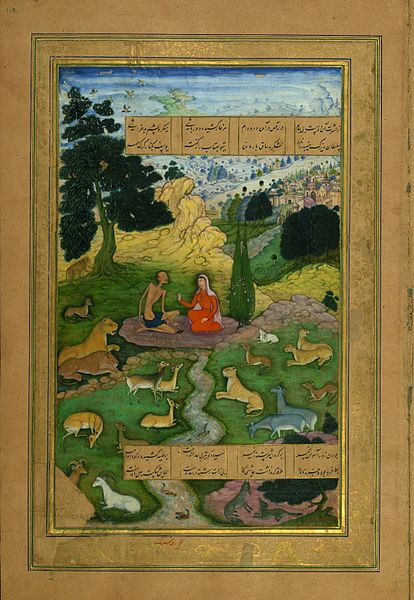
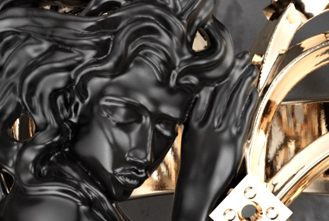

## Layla and Majnun
Layla & Majnun (Arabic: مجنون ليلى Majnūn Laylā, 'Layla's Mad Lover') is an old story of Arabic origin, about the 7th-century Najdi Bedouin poet Qays ibn al-Mulawwah and his ladylove Layla bint Mahdi (later known as Layla al-Aamiriya).

"The Layla-Majnun theme passed from Arabic to Persian, Turkish, and Indian languages",through the narrative poem composed in 584/1188 by the Persian poet Nizami Ganjavi, as the third part of his Khamsa. It is a popular poem praising their love story. Lord Byron called it "the Romeo and Juliet of the East."

## Layla
Layla was born around 648 AD (AH 28 in the Hijri) in the Najd, where the date of death unknown, during the succession of the fourth Umayyad caliph Marwan I and the fifth Umayyad caliph Abd al-Malik ibn Marwan in the 1st century of the Hijri in the Arabian Desert. 

Qays ibn al-Mullawah fell in love with Layla al-Aamiriya. He soon began composing poems about his love for her, mentioning her name often. His unselfconscious efforts to woo the girl caused some locals to call him "Majnun." When he asked for her hand in marriage, her father refused because it would be a scandal for Layla to marry someone considered mentally unbalanced. Soon after, Layla was married to another noble and rich merchant belonging to the Thaqif tribe in Ta'if. He was described as a handsome man with reddish complexion whose name was Ward Althaqafi. The Arabs called him Ward, meaning "rose" in Arabic.

When Majnun heard of her marriage, he fled the tribal camp and began wandering the surrounding desert. His family eventually gave up hope for his return and left food for him in the wilderness. He could sometimes be seen reciting poetry to himself or writing in the sand with a stick.

Layla is generally depicted as having moved to a place in Northern Arabia with her husband, where she became ill and eventually died. In some versions, Layla dies of heartbreak from not being able to see her would-be lover. Majnun was later found dead in the wilderness in 688 AD, near Layla's grave. He had carved three verses of poetry on a rock near the grave, which are the last three verses attributed to him.

Many other minor incidents happened between his madness and his death. Most of his recorded poetry was composed before his descent into madness.

    I pass by this town, the town of Layla
    And I kiss this wall and that wall
    It’s not Love of the town that has enraptured my heart
    But of the One who dwells within this town

It is a tragic story of undying love much like the later Romeo and Juliet. This type of love is known as "virgin love" because the lovers never marry or consummate their passion. Other famous virgin love stories set in Arabia are the stories of Qays and Lubna, Kuthair and Azza, Marwa and Al Majnoun Al Faransi, and Antara and Abla. This literary motif is common throughout the world, notably in the Muslim literature of South Asia, such as Urdu ghazals. 

Designing jewelry from home can be fun and rewarding. Through Jewelry Designs’ virtual jewelry service, you will have direct access to a designer and a personal shopper.

## 1. Chat With A Representative:
One of our designers will be with you shortly.From there, we will schedule a call or arrange a meeting to get started.

## 2. Actualize Your Concept:
Your jewelry designer will begin by establishing your needs and gathering relevant materials related to your project. From there, they will develop your idea and communicate with you using photos, computer generated renderings, and various design tools available to help you visualize your masterpiece.

## 3. Create Your Jewelry:
Once we have earned your complete confidence, we will customize a piece of fine jewelry to your specifications.

