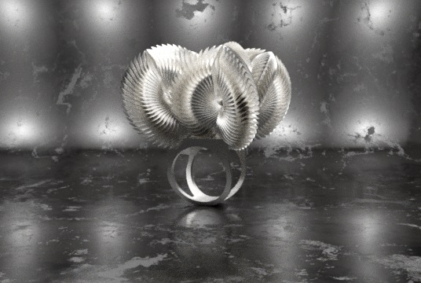
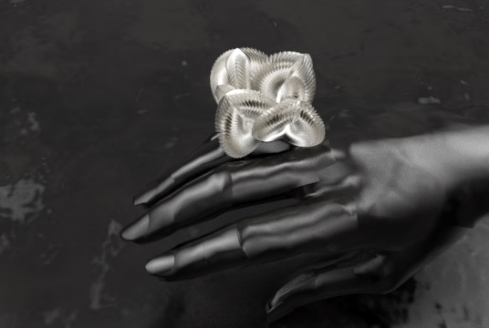

Giordano Bruno

Giordano Bruno (/dʒɔːrˈdɑːnoʊ ˈbruːnoʊ/; Italian: [dʒorˈdaːno ˈbruːno]; Latin: Iordanus Brunus Nolanus; born Filippo Bruno, January or February 1548 – 17 February 1600) was an Italian Dominican friar, philosopher, mathematician, poet, cosmological theorist, and Hermetic occultist. He is known for his cosmological theories, which conceptually extended the then-novel Copernican model. He proposed that the stars were distant suns surrounded by their own planets, and he raised the possibility that these planets might foster life of their own, a cosmological position known as cosmic pluralism. He also insisted that the universe is infinite and could have no "center".

Bruno’s system of thought is an incoherent materialistic pantheism. God and the world are one; matter and spirit, body and soul, are two phases of the same substance; the universe is infinite; beyond the visible world there is an infinity of other worlds, each of which is inhabited; this terrestrial globe has a soul; in fact, each and every part of it, mineral as well as plant and animal, is animated; all matter is made up of the same elements (no distinction between terrestrial and celestial matter); all souls are akin (transmigration is, therefore, not impossible). This unitary point of view is Bruno’s justification of “natural magic.”

The present project is inspired by The Mysterious Work of Giordano Bruno.

It is interesting to note that in most Western hermetic traditions that of these symbols, the square was accepted to represent the physical Earth, the hexagram representing the 5 classical planets and the Moon with the Sun at its center, with the circle representing the Divine monad. It is here, with these three inter-connecting shapes, where we would seem to find a parallel with Bruno’s belief that the three “minimums” (the divine, the geometric punctum and the physical atom) all hold the same center.

Giordano Bruno may have been considered a heretic during his time, but his work has since gone on to inspire many others; in the realm of science, in the realm of philosophy, in modern hermeticism and elsewhere.

Designing jewelry from home can be fun and rewarding. Through Jewelry Designs’ virtual jewelry service, you will have direct access to a designer and a personal shopper.

## 1. Chat With A Representative:
One of our designers will be with you shortly.From there, we will schedule a call or arrange a meeting to get started.

## 2. Actualize Your Concept:
Your jewelry designer will begin by establishing your needs and gathering relevant materials related to your project. From there, they will develop your idea and communicate with you using photos, computer generated renderings, and various design tools available to help you visualize your masterpiece.

## 3. Create Your Jewelry:
Once we have earned your complete confidence, we will customize a piece of fine jewelry to your specifications.

