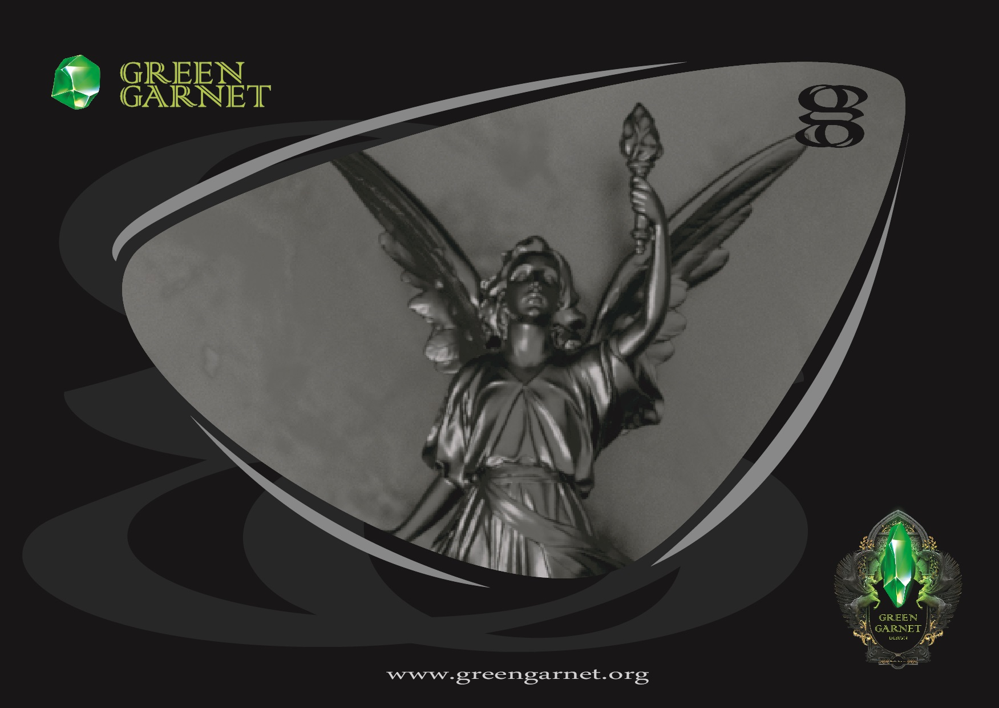
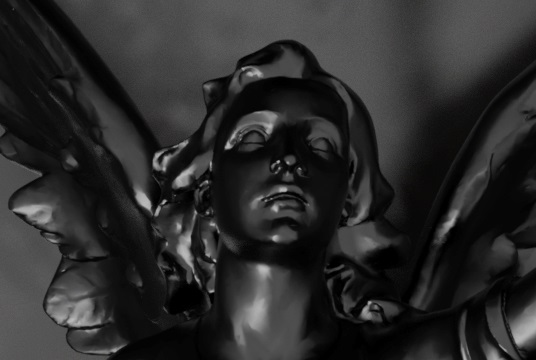
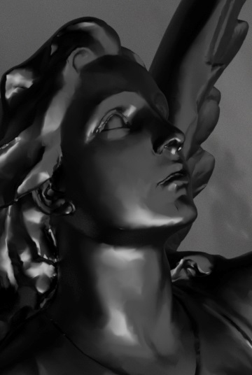

## Torch Angel Statue

Floating Angel with torch statue. A splendid piece depicting an Angel holding a torch in her left hand as she floats above the clouds.

Designing jewelry from home can be fun and rewarding. Through Jewelry Designs’ virtual jewelry service, you will have direct access to a designer and a personal shopper.

## 1. Chat With A Representative:
One of our designers will be with you shortly.From there, we will schedule a call or arrange a meeting to get started.

## 2. Actualize Your Concept:
Your jewelry designer will begin by establishing your needs and gathering relevant materials related to your project. From there, they will develop your idea and communicate with you using photos, computer generated renderings, and various design tools available to help you visualize your masterpiece.

## 3. Create Your Jewelry:
Once we have earned your complete confidence, we will customize a piece of fine jewelry to your specifications.
